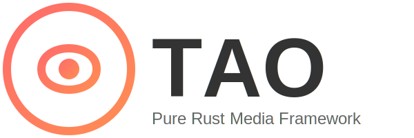

# Tao (道)

**纯 Rust 编写的多媒体处理框架。**

[English](README.md) | [中文 (Chinese)](README_CN.md)

## 什么是 Tao?

Tao (道) 是一个用纯 Rust 编写的多媒体处理框架，旨在成为 FFmpeg 的现代、内存安全的替代品。它提供了一套完整的工具和库，用于录制、转换和流式传输音频和视频。

**警告**: Tao 目前处于早期开发阶段。API 可能会发生变化。

## 设计目标

*   **纯 Rust**: 利用 Rust 的内存安全和并发特性。
*   **模块化**: 组件被拆分为多个 crate (`tao-core`, `tao-codec`, `tao-format` 等)。
*   **高性能**: 追求与 C/C++ 实现相当的高性能。
*   **兼容性**: 努力实现与 FFmpeg 的功能对等。

## 功能特性

*   **Tao CLI**: 类似于 `ffmpeg` 的命令行工具。
*   **Tao Probe**: 类似于 `ffprobe` 的多媒体流分析器。
*   **Tao Play**: 类似于 `ffplay` 的简易媒体播放器。
*   **格式支持**: 支持常见容器格式 (MP4, MKV, AVI 等)。
*   **编解码支持**: 支持常见编解码器 (H.264, AAC 等)。

## 文档

*   [快速开始指南](docs/quick_start_cn.md)
*   [API 文档](docs/api_docs_cn.md)

## 贡献

我们欢迎贡献！请参阅我们的 [贡献指南](CONTRIBUTING_CN.md)。

## 致谢与灵感

Tao 的架构和实现深受以下项目的启发和参考：
*   [FFmpeg](https://ffmpeg.org/)
*   [XVid](https://www.xvid.com/)
*   以及许多其他开源多媒体项目。

我们感谢开源社区在该领域的巨大贡献。

## AI 声明

本项目使用了各种不同的 AI 模型，包括 Gemini、Claude 和 Codex 等，用于代码生成和辅助。大约 99% 的工作由 AI 自动完成，人工仅负责流程控制和执行测试。

## 联系方式

如有疑问，请联系：**xjkuchao@gmail.com** (请注明：Tao 项目)。

## 许可证

本项目采用 MIT 许可证 - 详见 [LICENSE-MIT](LICENSE-MIT) 文件。
